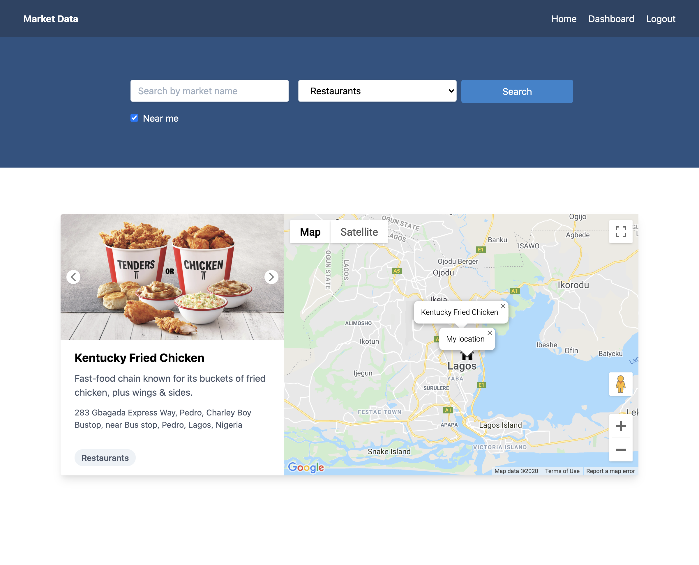

  <p align="center">A Mini Market Data Bank to show Food Market location</p>




- Live api can be found here [https://market-data-backend.herokuapp.com/api](https://market-data-backend.herokuapp.com/api)
- Live application can be found here [https://market-data-frontend.vercel.app](https://market-data-frontend.vercel.app)


- Users can search by any of market name, category or nearest location
 

## Installation

```bash
# Install dependencies
$ yarn install

# Copy and rename .env.sample to .env
$ cp .env.sample .env
```

Create Google API by following the instructions [here](https://developers.google.com/maps/documentation/geocoding/get-api-key)


## Running the app

```bash
# development
$ yarn start:dev
```
